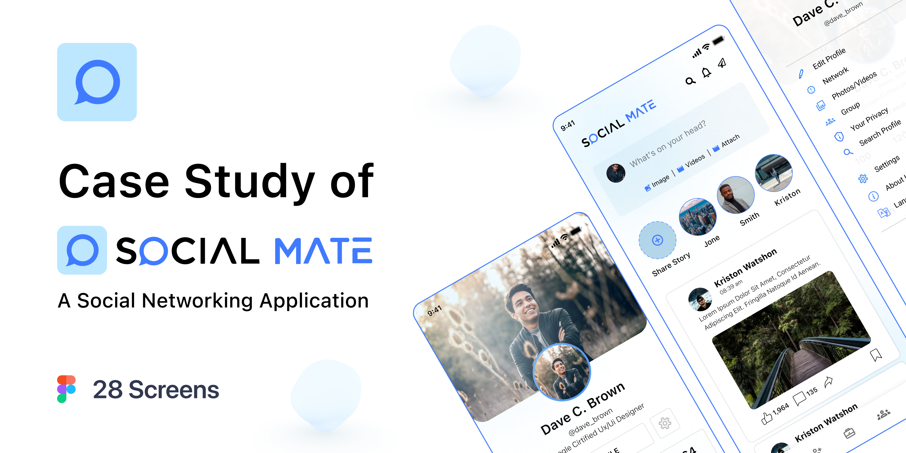
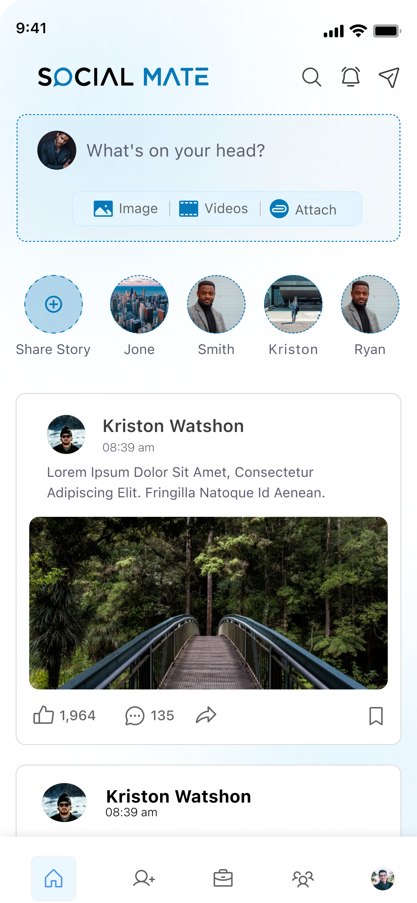
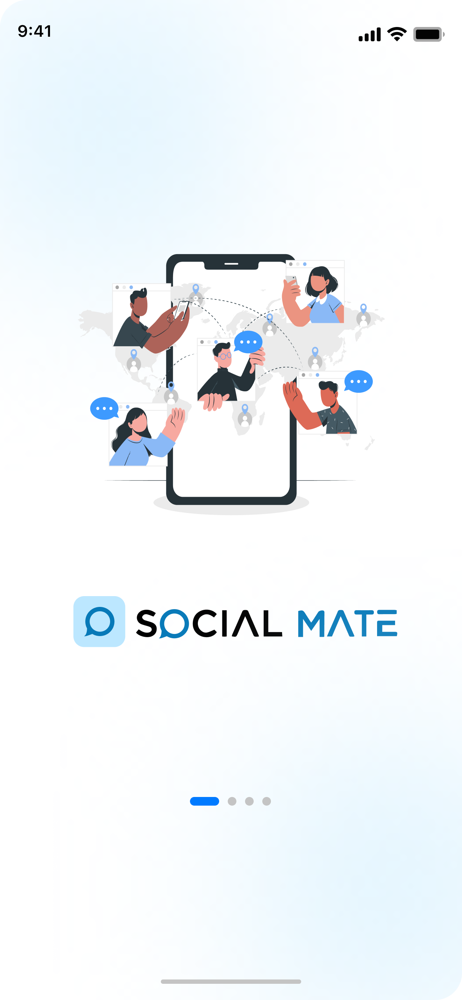
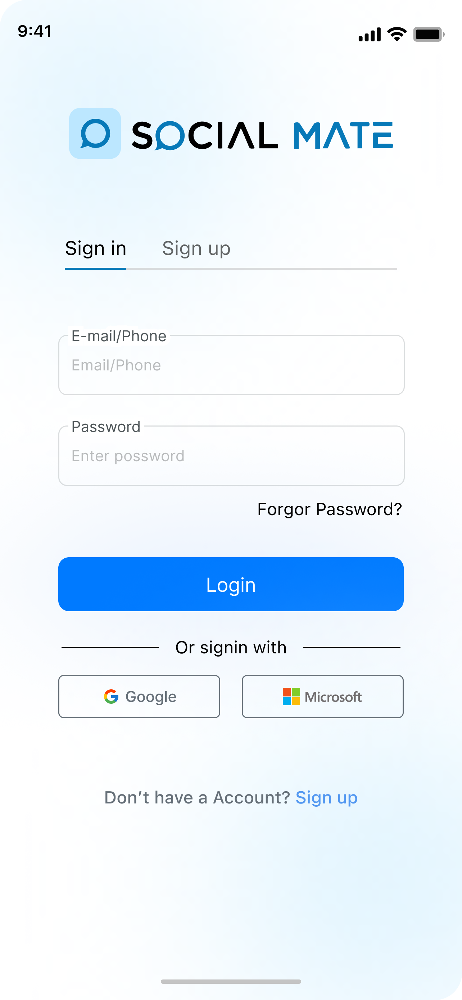
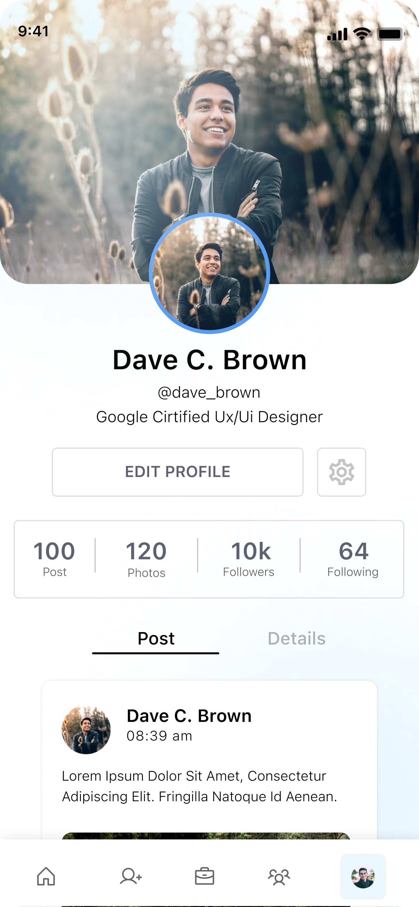
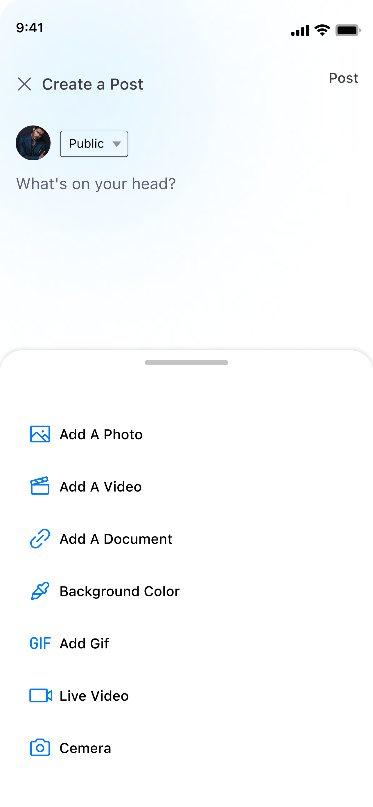
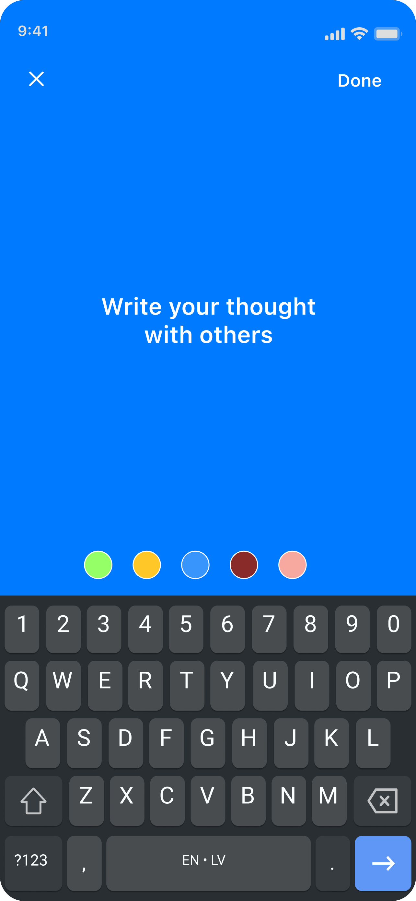
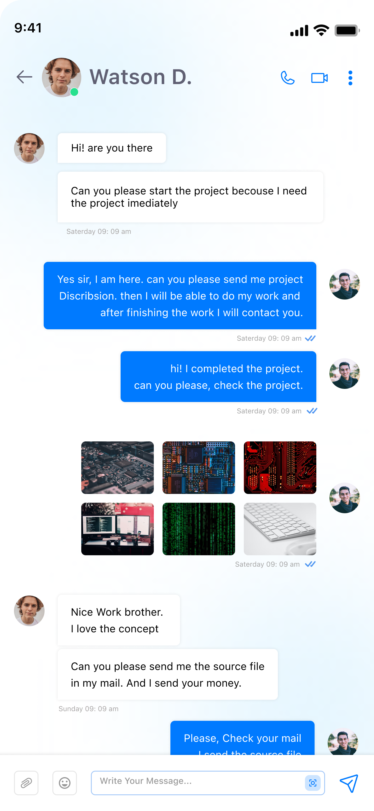

[](https://www.figma.com/community/file/1164103907030501213/social-mate-a-social-media-application-design)

---

## ✨ Badges


---

> ⚠️ **Project Status: In Development**  
>
> This project is still under active development.  
> Features, structure, and dependencies may change frequently until a stable release is published.  
> Contributions and feedback are always welcome!


---

# 📱 Social Mate

**Social Mate** is a cutting-edge, high-performance social networking platform engineered with **Flutter 🚀**. It represents a sophisticated mobile solution designed to provide users with a fluid, engaging, and secure environment for social interaction.

Built upon the robust foundations of **Clean Architecture 🏗️** and the **BLoC pattern 🧩**, the application ensures exceptional maintainability and scalability. By leveraging **Supabase ☁️** as its backend infrastructure, Social Mate delivers real-time data synchronization and secure authentication, all wrapped in a visually stunning, responsive interface that adapts perfectly to any device size via **ScreenUtil 📱**.

Whether it's sharing moments through rich media, navigating a dynamic social feed, or enjoying the seamless onboarding experience, every aspect of Social Mate is optimized for peak performance and visual excellence. ✨

---

## 📑 Table of Contents
- [🎯 Key Features](#-key-features)
- [✨ Badges](#-badges)
- [🚀 Getting Started](#-getting-started)
- [📦 Dependencies Used](#-dependencies-used)
- [📸 Screenshots](#-screenshots)
- [🛠️ Contributions](#️-contributions)
- [📜 License](#-license)

---

## 🎯 Key Features

### 🔐 Authentication & Security
- **Secure Sign Up & Sign In** - Robust authentication flow using Email/Password 📧.
- **Social Login Support** - UI integration for Google and Microsoft authentication 🌐.
- **Supabase Integration** - Backend authentication powered by Supabase ⚡.
- **Form Validation** - Real-time validation for user inputs with localized feedback ✅.

### 🏠 Social Interaction
- **Dynamic Home Feed** - Scroll through posts and updates 📰.
- **Stories System** - Interactive story viewing experience with immersive transitions 📱.
- **Post Creation** - "What's on your mind?" widget with multi-media support 📸.
- **Media Gallery Integration** - Seamless browsing and selection of local media 🖼️.
- **Bottom Navigation** - Quick access to key modules like Home, Add, and Groups 🧭.

### 🎨 User Experience & Design
- **Modern & Premium UI** - A polished, high-fidelity design focused on user engagement 💎.
- **Responsive Layout** - Adapts perfectly to various screen sizes and densities 📱.
- **Efficient Media Loading** - Optimized image caching and shimmering effects for a fluid experience ✨.
- **Interactive Toast Notifications** - Sleek, non-intrusive feedback for app actions 🔔.

### 🏗️ Architecture & Best Practices
- **Clean Architecture** - Organized folder structure (Data, Domain, Presentation) 📂.
- **BLoC Pattern** - Predictable state management using `flutter_bloc` and `cubit` 🔄.
- **Dependency Injection** - Scalable service locator using `get_it` and `injectable` 💉.
- **Routing** - Declarative navigation with `go_router` 🛣️.
- **Localization** - Full multi-language support setup 🌍.

---

## 🏗️ Project Architecture

This project follows **Clean Architecture** principles to ensure a highly scalable, maintainable, and testable codebase. The separation of concerns is strictly maintained across three primary layers:

### 1. 📂 Presentation Layer
*   **Widgets & Pages**: Pure UI components built with Flutter.
*   **BLoC / Cubit**: Handles state management and interacts with Domain usecases.
*   **Routing**: Managed via `go_router` for declarative navigation.

### 2. 🧠 Domain Layer (Pure Dart)
*   **Entities**: Simple Dart classes representing the core data models.
*   **Use Cases**: Contains specific business logic and coordinates data flow.
*   **Repositories (Interfaces)**: Defines contracts for data operations, ensuring the domain layer is independent of external dependencies.

### 3. 💾 Data Layer
*   **Repositories (Implementations)**: Implements the contracts defined in the Domain layer.
*   **Data Sources**: Handles direct communication with local storage or remote APIs (e.g., Supabase).
*   **Models**: DTOs (Data Transfer Objects) that handle JSON serialization/deserialization.

### 🧩 Folder Structure
```text
lib/
├── core/                  # Shared utilities, themes, DI, and routes
├── features/              # Modular features (e.g., auth, home)
│   └── [feature_name]/
│       ├── data/          # Repositories & Data Sources
│       ├── domain/        # Entities & Use Cases
│       └── presentation/  # UI (Pages & Widgets) & State Management
├── global/                # App-wide BLoCs and Global State
└── main.dart              # Entry point
```

---

## 🎨 UI Kit / Design System

The application follows a consistent and modern design language to ensure a premium feel across all screens.

### 🎨 Color Palette
*   **Primary**: `#007AFF` 🔵 - Used for main actions, active states, and branding.
*   **Secondary**: `#0779B8` 🔹 - Used for accents and secondary elements.
*   **Surface**: `#FFFFFF` ⚪ - Clean white background for a minimalist look.
*   **Error**: `#FF1E1E` 🔴 - Clear visibility for error states and destructive actions.

### ✍️ Typography
*   **Body & Headings**: Utilizing the default Material Design typography scale, optimized for readability.
*   **Responsive Scaling**: All text sizes are dynamically scaled using `flutter_screenutil` to ensure consistency across various device densities.

### 🖼️ Iconography
*   **SVG Icons**: Custom managed high-quality SVGs via `flutter_gen` for sharp visuals at any size.
*   **Cupertino Icons**: Standard iOS-style icons for a familiar and native mobile experience.

---

## 🚀 Getting Started

To run this app locally:

```bash
git clone https://github.com/AmrSalahDev/Social-Mate-Flutter-App.git
cd Social-Mate-Flutter-App
flutter pub get
flutter run
```

### ✅ Prerequisites
- 🐦 Flutter SDK 3.9.0 or higher
- 🎯 Dart 3.9.0 or higher
- 🏢 Android Studio / Xcode (for iOS development)
- 📱 Android/iOS device or emulator

### 📋 Steps
1. 📥 **Clone the repository**
2. 📚 **Install dependencies**: `flutter pub get`
3. ⚙️ **Generate code**: `flutter pub run build_runner build --delete-conflicting-outputs`
4. 🔐 **Setup Environment**: Create a `.env` file with your `SUPABASE_URL` and `SUPABASE_ANON_KEY`.
5. ▶️ **Run the app**: `flutter run`

---

## 📦 Dependencies Used

Below is a list of key packages used in this Flutter project:

### 🏗️ Architecture & State Management
- `flutter_bloc: ^9.1.1` - State management library 🧩.
- `bloc: ^9.2.0` - Core business logic component ⚙️.
- `bloc_concurrency: ^0.3.0` - Concurrency transformers for Bloc events ⚡.
- `get_it: ^9.2.0` - Service locator for dependency injection 💉.
- `injectable: ^2.7.1+4` - Code generation for GetIt 🏗️.
- `go_router: ^17.0.1` - Declarative routing package 🛣️.

### ☁️ Backend & Data
- `supabase_flutter: ^2.12.0` - Supabase client for Auth and Database ⚡.
- `flutter_dotenv: ^6.0.0` - Load environment variables from `.env` 🔐.
- `equatable: ^2.0.5` - Simplify object equality comparisons ⚖️.
- `photo_manager: ^3.8.3` - Handling local media assets with ease 📸.

### 🎨 UI & Assets
- `flutter_screenutil: ^5.9.3` - Screen adaptation tool 📱.
- `flutter_svg: ^2.2.3` - SVG rendering support 🖼️.
- `toastification: ^3.0.3` - Customizable toast notifications 🔔.
- `cached_network_image: ^3.4.1` - Caching and displaying network images efficiently 🖼️.
- `shimmer: ^3.0.0` - Shimmer loading effects for a premium feel ✨.
- `story_view: ^0.16.6` - Full-featured story viewing experience 📱.
- `dotted_border: ^3.1.0` - Easily create dashed or dotted borders 🔳.
- `readmore: ^3.0.0` - Expandable/collapsible long text segments 📖.
- `smooth_page_indicator: ^2.0.1` - Page indicators for onboarding 📑.
- `cupertino_icons: ^1.0.8` - iOS style icons 🍎.

### 🛠️ Utilities & Dev Tools
- `talker_bloc_logger: ^5.1.10` - Logging tool for Bloc state changes 📝.
- `my_flutter_toolkit` - Custom utility package 🧰.
- `get_time_ago: ^2.3.2` - Human-readable time formatting ⏳.
- `number_display: ^3.0.0` - High-performance number formatting for UI 🔢.
- `flutter_localization: ^0.3.3` - Advanced localization support 🌍.
- `build_runner: ^2.10.5` - Build system for code generation 🏗️.
- `flutter_gen_runner: ^5.12.0` - Asset generator 📂.

---

## 📸 Screenshots

<p float="left">
  
   
  
  
  
  
  
  
</p>

---

## 🎨 Figma Design

✨ Check out the app UI design in Figma:

[](https://www.figma.com/community/file/1164103907030501213/social-mate-a-social-media-application-design)

📌 Click the image to view the live Figma prototype.

---    

## 🛠️ Contributions

🤝 Feel free to fork the repo, open issues, or submit PRs to improve the app!

### 📝 To Contribute:
1. 🍴 Fork the repository
2. 🌿 Create your feature branch (`git checkout -b feature/AmazingFeature`)
3. 💾 Commit your changes (`git commit -m 'Add some AmazingFeature'`)
4. 📤 Push to the branch (`git push origin feature/AmazingFeature`)
5. 🔀 Open a Pull Request

---

## ⭐ Star History

If you like this project, please give it a star ⭐

[](https://star-history.com/#AmrSalahDev/Social-Mate-Flutter-App&Date)


## 📜 License

⚖️ This project is licensed under the MIT License - see the LICENSE file for details.

---

## 📧 Support & Contact

💬 For questions or support, feel free to open an issue on GitHub or contact the development team.

<p align="center">
  <strong>Built with ❤️ using Flutter</strong>
</p>